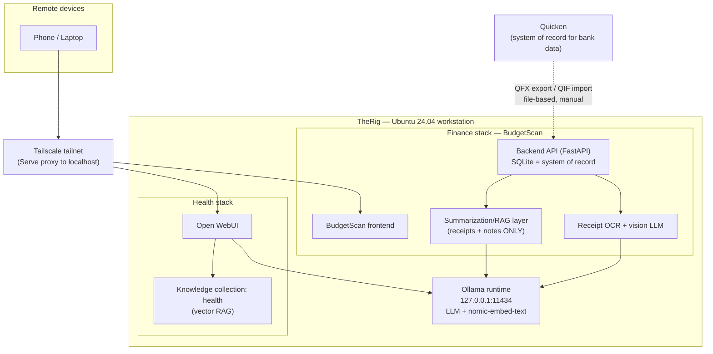

# TheRig — System Architecture

**Status:** Current as of 2026-07-18
**Owner:** jahrling
**Scope:** Local-first AI workstation hosting per-domain stacks (Finance, Health, and future domains), reachable remotely over Tailscale.

> **App build plan:** the original BudgetScan phased build plan and database
> schema now live at [`docs/BUILD_PLAN.md`](docs/BUILD_PLAN.md). This document
> covers system-level topology and decisions; per-decision records are in
> [`docs/adr/`](docs/adr/).

---

## 1. Overview

**TheRig** is the physical workstation (Ubuntu 24.04, Ryzen 7 7700X, RTX 5070 Ti 16GB — see `ai_workstation_build.md`). It is the single place where all local AI stacks land. It is not a service or an app; it is the host.

Each **domain** (Finance, Health, …) is an independent stack on TheRig. Domains do not share a datastore. This keeps sensitive data siloed and lets each domain use the retrieval approach that fits its data shape.

Remote access is via **Tailscale** only — no service is exposed to the public internet or the LAN.

---

## 2. Topology

---

## 3. Key decisions (summary — see `docs/adr/` for full records)

| # | Decision | Rationale |
|---|----------|-----------|
| 0001 | TheRig is host-only; each domain is an isolated stack | Data siloing; per-domain retrieval choices |
| 0002 | Quicken integration is file-based (QFX/QIF), never a live connector | Matches ecosystem consensus; keeps data local; no third-party aggregation |
| 0003 | Finance uses a structured store (SQLite) as source of truth; RAG only over unstructured receipt/note text | Embeddings blur numbers — aggregations must run against structured data |
| 0004 | BudgetScan owns the Finance interface; Open WebUI serves document-heavy domains (Health) | No duplicate finance UI; each tool used where it fits |
| 0005 | Remote access via Tailscale Serve; services stay bound to 127.0.0.1 | Preserves localhost-only binding; no LAN or public exposure |

---

## 4. Standing constraints

- **Binding:** services bind to `127.0.0.1`. Docker ports published as `-p 127.0.0.1:PORT:...` (Docker bypasses UFW — publishing to `0.0.0.0` is the #1 leak risk). Tailscale reaches them via Serve, not by rebinding.
- **Secrets & data:** QFX/QIF exports, the SQLite DB, receipts, the vector index, and `.env` are gitignored and must never enter git history (BudgetScan is a public repo).
- **GPU:** VRAM (16GB) is the binding constraint. Keep retrieved context tight; verify `size_vram > 0` after model loads (Blackwell CPU-fallback quirk).

---

## 5. Open / next

- **Finance summarization layer** — RAG over receipt/note text only, routing all numeric queries to SQLite. Implemented under `backend/src/finance/services/` (embeddings, vector_store, query_router, aggregation, finance_qa); see ADR 0003.
- **Health stack** hardening and Tailscale Serve exposure.
- Consider `log4brains` for auto-generated ADR graph once record count grows.
