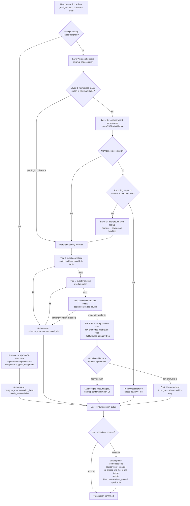

# Design: LLM-Powered Transaction Categorization

**Status:** proposed
**Author:** Fable (design pass), for Conrad / BudgetScan
**Related:** `docs/OPEN_ITEMS.md` § LLM-Powered Categorization, `docs/adr/0003-finance-structured-store-over-rag.md`
**Touches:** `finance.services.quicken`, `finance.services.categorizer`, `finance.services.embeddings`,
`finance.services.vector_store`, `finance.services.receipt`, `finance.models.merchant`, `finance.models.transaction`

## 1. Problem and scope

Bank-fed transaction descriptions ("SQ *JOES COFF", "AMZN MKTP US*2K7X", "TST* PIZZA HUT 0042") are
payment-processor artifacts, not merchant names. Categorizing them into the user's 149-node Quicken
category tree requires two separate resolutions that are currently conflated in people's heads but
must be *separate steps* in the pipeline:

1. **Identity**: what merchant is this actually?
2. **Category**: given that merchant (and this specific purchase), what category does it belong to?

Today the repo has the raw materials for both but doesn't connect them for bank transactions:

- `finance.services.quicken.MemorizedRule` — 391 payee→category rules, parsed from QIF but **only
  surfaced in the import preview JSON** (`ParseResultSchema.memorized_rules`). Nothing persists them
  or matches new transactions against them.
- `finance.services.categorizer.suggest_categories` — an LLM-backed categorizer, but scoped to
  **receipt line items only** (`materialize_transaction` / `build_ocr_preview` in `receipt.py`). It
  has no concept of memorized rules, merchant identity, or bank-transaction descriptions.
- `finance.models.merchant.Merchant` — has `normalized_name` and `default_category_id`, but nothing
  populates `normalized_name` from a cryptic bank string today; it's set at receipt/merchant-creation
  time from clean OCR'd merchant names.
- `finance.services.embeddings` / `finance.services.vector_store` — a working local embedding +
  cosine-similarity retrieval stack, but scoped by ADR-0003 to prose (annotations, receipt line
  items) for the Q&A layer, never transaction numbers.

This design proposes: (a) persisting memorized rules as a real table, (b) a tiered
identity-resolution step ahead of categorization, (c) reusing the existing embedding/vector-store
pattern for rule retrieval (a new, separate index — not the ADR-0003 prose index), and (d) wiring
this into the existing import/confirm workflow with explicit confidence tiers.

**Non-goal:** this pipeline never invents a dollar amount or performs aggregation. It only assigns a
`category_id` (a foreign key into a closed, user-owned set) — so it doesn't reopen the ADR-0003
debate about hallucinated numbers. Category assignment is closer to classification into an enum than
to generation.

## 2. Data model changes

Small additions, following the repo's existing SQLAlchemy/dataclass style:

```
MemorizedRule (new table, mirrors the QIF dataclass)
  id, payee (str, indexed), normalized_payee (str, indexed),
  category_path (str), category_id (FK -> categories.id, nullable until resolved),
  amount_cents (nullable), transfer_account (nullable), kind (str),
  source ("qif_import" | "user_created"), created_at

Merchant (extend existing table)
  + resolved_name (str, nullable)       -- clean human name, e.g. "Joe's Coffee"
  + resolution_source (str, nullable)   -- "heuristic" | "llm" | "web_lookup" | "receipt" | "user"
  + resolution_confidence (float, nullable)

Transaction (extend existing table)
  + category_id (FK -> categories.id, nullable)
  + category_confidence (float, nullable)
  + category_source (str, nullable)     -- "memorized_rule" | "llm" | "user" | "receipt_linked"
  + needs_review (bool, default True)   -- drives the confirm-queue UI
```

A `CategorySuggestionLog` (or just structured logging) recording `{transaction_id, candidate_category_id,
confidence, source, rule_ids_considered}` is worth having from day one — it's the eval harness for
§8 and the audit trail when the user asks "why did it pick this."

On import, `quicken.py`'s parser already builds `MemorizedRule` dataclasses — persist them once
(dedupe by payee+category_path) instead of only echoing them into the preview response.

## 3. Tiered retrieval over the 391 memorized rules

391 rules times an average path length won't blow a 7B model's context on its own, but stuffing all
391 into every prompt is wasteful (latency, and it dilutes the few-shot signal — the model attends
better to 5 relevant examples than 391 mixed ones). The right model is a cascade that resolves the
*easy* majority without ever calling the LLM, and only asks the LLM to interpolate for the remainder:

**Tier 0 — exact normalized match (deterministic, ~0ms).**
Normalize both sides (lowercase, collapse whitespace, strip common processor tokens — see §4) and
look up `normalized_payee` in the `MemorizedRule` table. Historical experience shows most recurring
payees (Netflix, Costco, your mortgage servicer) appear verbatim or near-verbatim every time. This
tier alone probably resolves 60-80% of recurring transactions with zero LLM involvement and zero
risk of being wrong in a way the user's own Quicken habits wouldn't have been wrong.

**Tier 1 — substring / token-overlap match (deterministic, ~0ms).**
If Tier 0 misses, check whether any memorized payee is a substring of the cleaned description or
shares its dominant token (e.g. rule payee "Amazon" vs. cleaned description "AMZN MKTP US"). This
catches minor formatting drift without needing embeddings. Keep this tier conservative — require the
matched token to be ≥5 characters or a known brand token, so "CVS" doesn't accidentally match every
description containing "CVS" as a substring of something else.

**Tier 2 — embedding retrieval, top-k (fast, local, ~10-50ms on CPU for 391 vectors).**
If Tiers 0-1 miss, embed the cleaned merchant string with the existing `OllamaEmbedder`
(`nomic-embed-text`, already used for the prose RAG index) and retrieve the top-k (5-8) most similar
memorized rules by cosine similarity — same math as `vector_store.VectorStore.search`, just a second,
separate flat index (`data/vector/rules_index.json`) built once at startup/import time from all
persisted `MemorizedRule.payee` strings, rebuilt whenever rules change. This is a new index, not a
reuse of the ADR-0003 prose index — keep them separate since they serve different retrieval
semantics (rule matching vs. Q&A over annotations) even though the plumbing is identical.

These top-k rules become the **few-shot examples** injected into the Tier 3 LLM prompt below. This is
the answer to "391 rules don't fit in context": don't try to fit them — retrieve the handful that are
actually relevant to *this* transaction, the same way you'd do RAG for anything else. The category
tree (149 nodes, flattened to `id: path` lines exactly like `categorizer._build_category_lines`) is
small enough to always include in full — that one already fits comfortably.

**Tier 3 — LLM with retrieved few-shot rules (the expensive, contested path).**
Only transactions that miss Tiers 0-2 with low similarity scores (or where the top match's category
disagrees with a second signal, e.g. a receipt — see §6) go here. See §4 for prompt design.

**Tier 4 — web lookup harness.** Only when the LLM itself can't confidently name the merchant. See §7.

The cascade means the LLM is invoked for the minority of transactions — new merchants, one-off
purchases, or the (hopefully rare) cases where Tier 2's similarity score is too low to trust as a
direct answer. This matters practically: Ollama on a single RTX 5070 Ti serializes requests against
one loaded model, and OCR (vision) and categorization (text) contend for the same GPU. Keeping LLM
calls to the minority of transactions is what keeps a 500-transaction QFX import from taking 20
minutes.

## 4. Merchant name resolution (identity, before category)

Layered, cheapest-first, exactly like the retrieval cascade above:

**Layer A — regex/heuristic cleanup (deterministic, instant).** Strip known processor prefixes and
suffixes before anything else touches the string:
- Processor tags: `SQ *`, `TST*`, `PAYPAL *`, `SP `, `IC* `, `AMZN MKTP US*`
- POS boilerplate: `POS DEBIT`, `PURCHASE`, `RECURRING PMT`, trailing terminal/store numbers
  (`#0042`, ` 0042`), trailing state abbreviations, trailing city names if two-letter state follows
- Card-network noise: trailing card-last-4, transaction reference numbers (long digit runs)

This is the single highest-leverage, lowest-risk piece of this whole design — a well-maintained
regex table turns "SQ *JOES COFF" into "JOES COFF" for near-zero cost, and "TST* PIZZA HUT 0042" into
"PIZZA HUT" outright. Build this as a small ordered list of `(pattern, replacement)` rules, seeded
from patterns visible in the user's actual QFX/QIF history (a one-time scan of existing imported
descriptions will surface the recurring processor prefixes fast), and treat it as a living file the
user can extend when a new prefix shows up — cheaper to add a regex line than to re-prompt an LLM.

**Layer B — known-merchant lookup.** Normalize the cleaned string and check `Merchant.normalized_name`.
If it matches an existing merchant (created previously from a receipt, a web lookup, or a user
correction), identity is resolved for free and `Merchant.default_category_id` / the memorized-rule
cascade in §3 runs directly off the resolved name — no LLM call needed at all.

**Layer C — LLM merchant-name guess.** Only if Layers A-B don't resolve. Ask the *text* model
(`qwen2.5:7b` via Ollama, same as `categorizer._call_ollama_text`) a narrow, single-purpose question:
"what business does this cleaned string most likely refer to?" Keep this call separate from the
categorization call in §5 — resolving identity and choosing a category are different judgments, and
conflating them into one prompt makes both worse on a 7B model. Require the model to also emit a
confidence label (see §5's rubric) because a 7B model's merchant guesses are the least reliable part
of this pipeline — it has no real-world knowledge cutoff advantage here, it's pattern-matching
abbreviations, and it will confidently guess wrong (e.g. mapping "TST*" — Toast POS, the payment
processor — to an invented company literally named "TST"). Never let this guess silently become the
`Merchant.resolved_name` without a confidence gate; low-confidence guesses fall through to Layer D.

**Layer D — web lookup harness.** Last resort, described fully in §7.

Each layer that successfully resolves identity writes back to `Merchant` (creating the row if needed)
with `resolution_source` and `resolution_confidence` set, so the *same* cryptic string never has to be
re-resolved — this is the actual context-scaling strategy for merchant identity: resolve once per
unique normalized string, ever, then it's a Layer B hit for every future occurrence.

## 5. Prompt engineering for the categorization call (Tier 3)

Design constraints specific to a 7B model, learned from what already works in this repo's own
`categorizer._llm_suggest` and `ocr.PROMPT`:

- **Structured JSON output, not prose.** Use Ollama's `format: "json"` parameter (already used by
  both `categorizer.py` and `ocr.py`) rather than asking the model to format its own JSON — this
  measurably reduces malformed output on small models and removes the need for elaborate parsing.
- **IDs, not names, for categories.** Exactly like `_build_category_lines`: the model chooses an
  integer id from an enumerated list, never free-texts a category name. This sidesteps fuzzy string
  matching, typos, and the model inventing a category that doesn't exist ("Food & Drink" vs. the
  real "Food & Dining"). Validate the returned id against the real category set before trusting it.
- **Skip chain-of-thought; ask for a confidence label instead.** Long reasoning traces on a 7B model
  are slow, don't reliably improve small-model classification accuracy the way they do on frontier
  models, and are easy to have "reasoning" that doesn't match the final answer. A cheaper, more
  reliable signal for the same purpose (deciding whether to trust the output) is a **direct confidence
  self-rating** — `"high" | "medium" | "low"` — as a required JSON field. It's not perfectly
  calibrated, but combined with the retrieval-similarity score from §3 it's a usable second signal for
  the confidence gate in §6, and it costs almost nothing extra.
- **Few-shot from retrieved rules, not from a fixed static example set.** The few-shot examples are
  the top-k memorized rules retrieved in Tier 2 — this is what makes a 7B model's categorization
  useful despite its size: it isn't being asked to know that "Costco → Groceries", it's being shown
  *the user's own* 5 most-similar historical mappings and asked to interpolate. This is the load-
  bearing idea of the whole design: retrieval quality matters more than model size here.
- **One transaction per call during Tier 3, batched category+rules context.** Unlike receipt line
  items (already batched in `categorizer.suggest_categories`, since they share one merchant and one
  category tree), Tier-3 bank transactions have different merchants and different retrieved rules
  each — so they can't share a single prompt the way receipt items do. Batch by *emitting multiple
  transactions in one prompt only when their Tier-2 retrieval sets are similar enough* (e.g. an
  import batch with several unresolved transactions from the same new merchant), otherwise keep
  calls per-transaction but rely on the Tier 0-2 cascade to keep the LLM's queue small.

Prompt sketch (structure, not final copy):

```
You are categorizing a bank transaction into the user's existing category list.
The user has categorized similar transactions before — use those examples.

Category list (id: path):
12: Food & Dining:Groceries
47: Transportation:Fuel
...

Similar past transactions (payee -> category the user chose):
"COSTCO WHSE #0042" -> Food & Dining:Groceries
"COSTCO GAS" -> Transportation:Fuel
...

New transaction:
  Cleaned description: "COSTCO WHSE #0611"
  Amount: $84.13
  Resolved merchant (if known): Costco

Respond with JSON only:
{"category_id": <int, must be from the list above>,
 "confidence": "high" | "medium" | "low",
 "merchant_guess": "<string, your best guess at the real merchant if not already resolved>"}
```

Including the amount as *context* (not as something to embed or aggregate — see ADR-0003) is useful
signal a human uses too: the same merchant string at $84 vs. $8,400 might be groceries vs. an
appliance. It stays a read-only field in the prompt; nothing downstream treats the model's amount
handling as authoritative.

## 6. Confidence tiers and human-in-the-loop UX

Three buckets, mapped onto the existing import/confirm workflow (the same one that already
color-flags `likely-duplicate` candidates in orange for the user to decide):

| Tier | Condition | Behavior |
|---|---|---|
| **Auto-assign** | Tier 0 exact memorized-rule match, or Tier 2 similarity ≥ a high threshold (e.g. 0.92) with a single dominant match, or `Merchant.default_category_id` set with high historical consistency | Category is set, `category_source` recorded, `needs_review = False`. Shown in the confirm list already filled in, un-highlighted — the user can still override, but isn't required to look. |
| **Suggest** | Tier 3 LLM result with `confidence: high` or `medium` AND agreement with Tier 2's retrieval (or no retrieval hit, novel merchant) | Category pre-filled but visually marked (e.g. the same orange-flag pattern used for likely-duplicates) with a one-tap confirm/change control. `needs_review = True` until the user acts. |
| **Punt** | LLM `confidence: low`, or the model returned an invalid/out-of-range category id, or merchant identity itself never resolved past Layer A/B, or amount is unusually large relative to the merchant's history | Shown as "Uncategorized" with the LLM's guess offered only as a *hint* in a tooltip/subtext, not pre-filled. Forces a deliberate choice rather than a habitual one-tap accept. |

UX specifics:
- Reuse the existing confirm-queue screen (the one built for import review) rather than a new page —
  add a category column/chip with the three visual states above, consistent with the existing
  likely-duplicate orange convention so the app has one visual language for "the system guessed,
  please glance at this."
- Every suggested category shows its **source** on hover/tap: "matched rule: Costco → Groceries" or
  "similar to 3 past transactions" or "LLM guess (low confidence)" — this is what makes a wrong guess
  fixable and trustworthy rather than a black box, and it's nearly free to add since §2's
  `category_source` field already captures it.
- **Every user correction is a training signal, not just a UI action.** When the user changes a
  category (in Suggest or Punt), write a new `MemorizedRule` (source `"user_created"`) or update the
  existing one for that normalized payee, and re-embed it into the Tier-2 rule index. This is how the
  391 rules grow over time without another manual QIF export/import round-trip, and it's the reason
  Tier 0's hit rate should climb the longer the app is used.
- Batch actions matter for solo-dev practicality: "accept all Auto-assign" and "accept all Suggest
  above confidence X" as bulk buttons, since a 500-transaction import shouldn't require 500 taps.

## 7. Receipt OCR integration

Receipts are the strongest disambiguation signal this pipeline has access to, and the existing OCR
pipeline already produces exactly what's needed — this should be treated as a first-class input to
categorization, not an afterthought:

- **Merchant identity for free.** When a receipt is matched to a bank transaction (the
  date+amount-then-merchant matching already on the roadmap in `docs/OPEN_ITEMS.md` under "Receipt
  holding pool with transaction suggestions"), the receipt's OCR'd `merchant` field is ground truth —
  "Joe's Coffee Shop," not "SQ *JOES COFF." This resolves Layer C/D of §4 without ever calling the
  LLM or the web: the moment a receipt is linked, write `Merchant.resolved_name` from
  `parsed["merchant"]`, `resolution_source = "receipt"`, `resolution_confidence = 1.0` (a human held
  the receipt and photographed it — that's about as ground-truth as this system gets), and the very
  next occurrence of that payee string hits Layer B.
- **Category comes from the existing line-item categorizer, already built.** `receipt.py`'s
  `materialize_transaction` already calls `categorizer.suggest_categories` per line item and stores
  per-`LineItem` categories. When a receipt later links to a bank transaction, prefer the
  receipt-derived split over a fresh Tier-3 guess on the bare bank description — a receipt with a
  Costco run of groceries + a $40 electronics item is *better* information than a single "COSTCO
  WHSE #0611 → Groceries" guess, because it's an actual itemized split. Concretely: if a transaction
  has a linked receipt with line items, categorization should skip §3's cascade entirely for that
  transaction and instead promote the receipt's items to the transaction's split, with
  `category_source = "receipt_linked"` and no confidence gate needed — it's Auto-assign tier by
  construction.
- **Timing note.** Receipts typically arrive same-day (phone snap at checkout); the bank transaction
  usually posts 1-3 days later. So in practice the receipt often *exists first* — meaning the
  matching step in the receipt-holding-pool feature should run before Tier 0-3 categorization even
  starts for freshly-imported bank transactions, not after. Sequence matters: match receipts first,
  categorize whatever's left.

## 8. Web lookup harness (Tier 4 / Layer D)

This is explicitly a **harness capability, not a model capability** — do not give the 7B model a
tool-calling loop to decide when and how to search the web. Small local models are unreliable at
knowing when they don't know something and at formulating good search queries; both of those
judgments belong in deterministic backend code that decides *whether* to search and constructs the
query itself.

**Trigger conditions (all must hold, to keep this rare and cheap):**
1. Layers A-C in §4 all failed to resolve identity with acceptable confidence.
2. The payee has been **seen at least twice** (recurring) OR the single transaction amount exceeds a
   configurable threshold — i.e. it's worth spending the lookup budget on. A single $6 one-off
   mystery charge isn't worth a network call; a recurring $45/month charge from an unresolved payee
   is.
3. Not already attempted and cached as a failure recently (see caching below) — don't re-search the
   same mystery string on every import.

**Approach:** a plain HTTP search call from the FastAPI backend (not from inside the Ollama prompt),
using a lightweight, no-API-key search endpoint (e.g. a self-hosted SearXNG instance is a natural fit
here — TheRig already runs several local services, and it keeps the "local-first" property this app
is built around rather than sending payee strings to a third-party search API) or, if operational
simplicity wins, a metered API like Google Places/Bing with a generous free tier. Query construction
is deterministic: take the Layer-C merchant guess (if any) or the Layer-A cleaned string, append
generic disambiguating terms ("business name"), and send *only* that string — never the transaction
amount, date, or account — to the external service. That's a hard privacy boundary worth stating
explicitly in code comments given the local-first design philosophy elsewhere in this repo.

**Result handling:** the harness parses the top search result(s) for a business name candidate (title
of the top hit is often enough; no need for a scraping/parsing pipeline beyond that) and treats it the
same as a Layer-C guess: written to `Merchant` with `resolution_source = "web_lookup"` and a
confidence that starts conservative (`medium` at best) until a human confirms it once — after which
it's promoted to `resolution_confidence = 1.0` and never looked up again for that string.

**Keeping it out of the critical path:** run Tier 4 as a background task, not inline in the
import/confirm request. The transaction lands in the confirm queue immediately as "Uncategorized /
looking up merchant…", identical to how `receipt.py`'s OCR already runs via
`process_in_background` with its own session. When the lookup completes it updates the transaction
in place (websocket/poll-refresh on the confirm screen, or just a re-fetch), and if it fails or times
out the transaction simply stays in the Punt tier — never blocks, never crashes the import. Set a
short timeout (a few seconds) and a hard cap on lookups per import batch, since this is the one part
of the pipeline reaching outside the LAN and the only one with unpredictable latency.

## 9. End-to-end data flow



Key property of this flow: **every step that costs something (LLM call, web lookup) is gated by a
cheaper step failing first**, and **every terminal state feeds back into the cheap deterministic
tables** (`Merchant`, `MemorizedRule`) so the same cryptic string is progressively more likely to
resolve at Tier 0/Layer B on every subsequent occurrence. The system should get faster and more
autonomous the longer it's used on the same set of recurring payees — which, for a personal finance
app, is most of the transaction volume.

## 10. Practical trade-offs for a solo dev running this locally

- **Don't over-invest in Layer C/Tier 3 prompt tuning before Layer A is solid.** The heuristic cleanup
  regex table is the highest ROI-per-hour piece of this design and has zero model risk. A day spent
  cataloguing real processor prefixes from the user's actual QFX history will outperform a week of
  prompt iteration on the 7B model.
- **Build the eval harness from the 391 existing rules before shipping Tier 3.** Since the memorized
  rules are real historical ground truth, a cheap pre-launch test is: for each rule, remove it from
  the Tier-0/1/2 pool, run the full cascade as if it were a new transaction, and check whether the
  result matches the held-out category. This calibrates the confidence thresholds in §6 against real
  data instead of guessing, and costs nothing but compute time already available on TheRig.
- **GPU contention is real.** One RTX 5070 Ti, one Ollama instance, and now three consumers (receipt
  OCR's vision model, this pipeline's text model, and the existing Q&A embedding/generation path) all
  share it. Serialize categorization behind receipt OCR during a bulk import rather than trying to
  parallelize — a queue, not concurrent Ollama calls, keeps VRAM pressure predictable. This also
  argues for keeping Tier 3/Layer C calls rare (per §3-4) rather than trying to make them fast.
- **Resist adding tool-calling/agentic loops inside the 7B model.** Every capability that needs a
  judgment about *when* to invoke it (search the web, ask the user, retry with different examples)
  should be harness logic with explicit thresholds, not something delegated to the small model's own
  discretion. This mirrors the receipt pipeline's existing philosophy (`ocr.py`, `categorizer.py`:
  the model does one narrow structured-output task per call; the surrounding Python code makes every
  branching decision) and it's the difference between a debuggable pipeline and a black box when a
  391-rule cascade produces a wrong answer at 11pm and you're the only one who can fix it.

## 11. Rule management: CRUD, suggestions, and Quicken parity

### 11.1 Rule sync is one-way (Quicken → BudgetScan)

The 391 memorized rules flow in via QIF import and are persisted to the `MemorizedRule` table (§2).
New rules created in BudgetScan stay in BudgetScan — we do not write rules back to Quicken. This is
deliberate: Quicken's QIF format is an export artifact, not a sync protocol, and trying to push rules
back would create a fragile bidirectional sync with no real upside.

**Quicken drift risk:** if the user adds new memorized rules in Quicken after the initial import,
those rules won't appear in BudgetScan until the next QIF import. The existing QIF parser already
handles this — it dedupes by `payee + category_path` on import, so re-importing a full QIF is safe
(idempotent insert-or-update). The practical workflow is: periodically re-export from Quicken and
re-import into BudgetScan to pick up any new Quicken-side rules. Over time, as BudgetScan's own
rule creation (§11.2-11.3) matures, the user may stop maintaining rules in Quicken entirely.

**Conflict resolution on re-import:** when a QIF re-import contains a rule for a payee that already
has a `user_created` rule in BudgetScan, the system must **not** silently overwrite or silently
ignore. Instead, surface the conflict to the user with three options:

1. **User rule wins** — keep the BudgetScan rule, ignore Quicken's version for this payee.
2. **Quicken overwrites** — update to match Quicken's current mapping; the user-created rule is
   deactivated (not deleted, for audit trail).
3. **Keep both** — both rules coexist; user-created rules are checked first during matching.

The conflict UI should show context for both sides: the existing BudgetScan rule (payee, category,
when created, how many transactions it's matched) and the incoming Quicken rule (payee, category
path). For Quicken-sourced rules that differ from an existing BudgetScan rule, provide a suggestion
based on which one has matched more transactions recently, making it easy for the user to make an
informed choice and easy to undo if they change their mind. Non-conflicting rules (new payees, or
payees where only a `qif_import` rule exists) are imported/updated automatically with no prompt.

### 11.2 Creating and managing rules in BudgetScan (CRUD)

BudgetScan needs its own first-class rule management, not just passthrough from Quicken. Rules should
be a full CRUD resource:

- **Create:** user explicitly creates a rule with a payee pattern, target category, and optional
  amount filter. The UI should make this easy but *never automatic* — see §11.4 below.
- **Read/List:** browsable, searchable list of all rules (both `qif_import` and `user_created`
  sources), showing payee pattern, target category, match count, last matched date, and source.
- **Update:** edit payee pattern, category, or amount filter. Changes take effect on the next
  categorization pass; previously-categorized transactions are NOT retroactively re-categorized
  unless the user explicitly requests a re-run.
- **Delete:** remove a rule. Soft-delete preferred (mark inactive) so the audit trail in
  `CategorySuggestionLog` remains interpretable.

API surface: standard REST endpoints under `/api/rules/` with the usual CRUD verbs, consistent with
the existing API patterns in this repo.

### 11.3 Auto-suggested rules (draft rules from Tier 3/4 patterns)

When the categorization pipeline reaches Tier 3 or 4 for a transaction and the user subsequently
confirms or corrects the category, the system should *draft* a candidate rule — but **not**
automatically create one. Drafts are held in a `status: "draft"` state on the `MemorizedRule` table
(new field: `status` enum `"active" | "draft" | "inactive"`).

The suggestion workflow:

1. **Pattern detection runs in the background.** After each confirmed batch of transactions, a
   lightweight pass looks for payee strings that (a) hit Tier 3/4 at least twice, and (b) were
   confirmed to the same category both times. These become draft rules.
2. **Drafts surface in the rule management UI** with a visual distinction (e.g. a "Suggested" badge)
   and a one-tap "Activate" action. The user can also edit the draft before activating — maybe the
   payee pattern needs broadening or the category needs adjusting.
3. **Bulk actions on drafts:** "activate all," "dismiss all," or review one-by-one. Same UX
   philosophy as the confirm queue (§6) — respect the user's time for a large batch.
4. **Dismissed drafts are remembered** (marked `"inactive"`) so the same pattern doesn't get
   re-suggested endlessly.

This replaces the Quicken model of "rules grow only when you explicitly create them in a modal
dialog" with a smarter loop: the system observes your corrections and proposes rules, but you remain
in control of which rules actually take effect.

### 11.4 Don't auto-create rules on manual category changes

Quicken's behavior of popping up a "create a memorized rule?" dialog every time the user manually
changes a transaction's category is a known annoyance. BudgetScan should **not** replicate this.

Instead:
- **Manual category changes are just that — manual changes.** They update `Transaction.category_id`
  and `category_source = "user"` for that specific transaction, period. No modal, no interruption.
- **Pattern detection (§11.3) runs asynchronously**, not in the UI flow of editing a single
  transaction. If the user re-categorizes the same payee pattern enough times, it'll surface as a
  draft rule in the rule management screen — but never as an in-your-face dialog blocking the
  current task.
- **Explicit rule creation is always available** via the rule management UI (§11.2), for when the
  user *knows* they want a rule and doesn't want to wait for the suggestion engine.

### 11.5 Rule preview: show what matches before committing

A significant gap in Quicken's rule management: there's no way to preview the effect of a rule
before (or after) creating it. BudgetScan should provide this as a first-class feature:

- **Preview on create/edit:** when creating or editing a rule, the UI shows a live-updating list of
  existing transactions that would match the rule's payee pattern (and amount filter, if set). This
  lets the user see immediately whether a pattern is too broad ("AMAZON" matching both marketplace
  purchases and AWS charges) or too narrow (missing a variant spelling).
- **Preview on existing rules:** in the rule list view, each rule shows its current match count, and
  clicking through shows the actual matched transactions. This is useful for auditing: "is this rule
  still doing what I intended?"
- **Impact preview for category changes:** when editing a rule's category, show which already-
  categorized transactions would be affected if the user chose to re-run categorization — without
  actually changing anything until explicitly confirmed.
- **Dry-run mode for bulk operations:** "what would change if I activated these 12 draft rules?" —
  a summary of affected transactions with before/after categories, reviewable before committing.

This preview capability is genuinely novel relative to Quicken and is one of the clearest value-adds
of building a custom tool vs. staying in the Quicken ecosystem.
